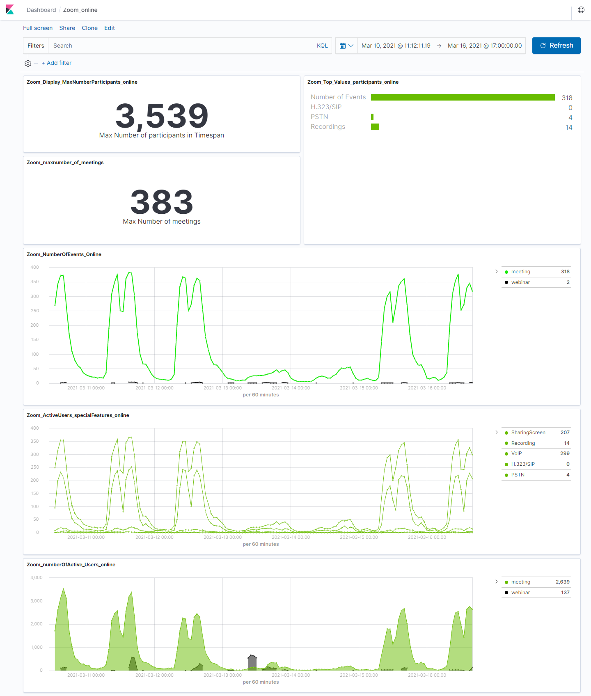
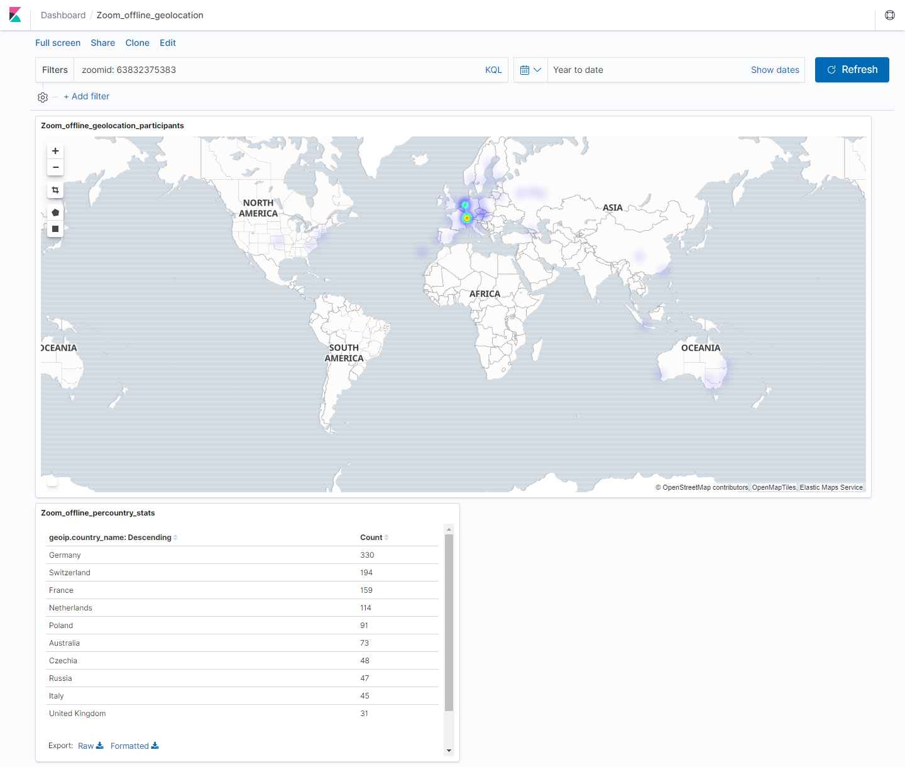

## Description

Getting Dashboards metrics from Zoom.

Based on [Indico Zoom plugin](https://github.com/indico/indico-plugins/tree/master/vc_zoom) and [Zoomus github project](https://github.com/prschmid/zoomus).

Project has been done on Python 3.6.5.

## Get it locally

Just do:

```
cd ~user
git clone https://gitlab.cern.ch/videoconference/zoom-dashboard.git
cd zoom-dashboard
python -m pip install --user --upgrade pip
python -m venv venv
source ./venv/bin/activate
pip install -r requirements.tx
```

## Upgrade images in CERN registry (only CERN)

So they can be recalled in Kubernetes.

```
docker login gitlab-registry.cern.ch
docker build --tag zoom-dashboard:latest .
docker build -t gitlab-registry.cern.ch/videoconference/zoom-dashboard .
docker push gitlab-registry.cern.ch/videoconference/zoom-dashboard
```

## Deploy on Kubernetes (only CERN)

Deployment is done on the [Kubernetes infrastructure](https://clouddocs.web.cern.ch/containers/README.html) (authentication required) at CERN. So after setting the Openstack project and setting the environment for the Kubernetes cluster I do:

```
$ eval $(ai-rc "IT project")
$ . ./env_zoom-dashboard.sh
--further setup omitted 
$ kubectl apply -f zoom-dashboard.yml
$ kubectl apply -f zoom-dashboard-filebeats.yml
```

## Visualization on Kibana 

Finally a set of dashboards has been produced e.g. view of the live statistics 



View of the location of attendees on a particular meeting:


